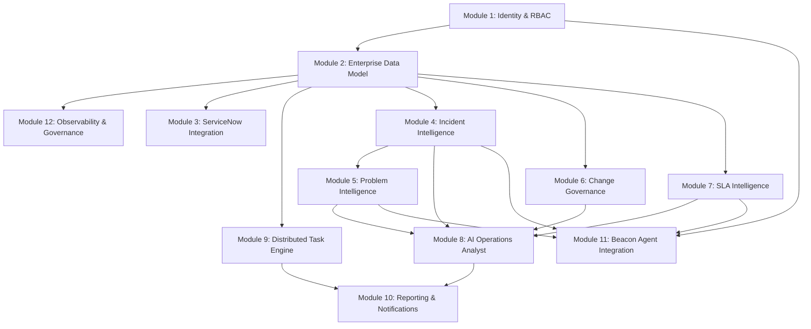

# OPSINTEL — Master Enterprise Implementation Plan & Architectural Blueprint

**Document ID:** OPSINTEL-ENT-PLAN-2026-001  
**Version:** 1.0 (Master Enterprise Execution Blueprint)  
**Date:** August 22, 2026  
**Author / Lead Implementation Lead:** Antigravity (Lead Implementation Engineer)  
**Authority:** Chief Architect, Product Leadership, Enterprise Engineering Stakeholders  
**Status:** READY FOR CHIEF ARCHITECT REVIEW & EXECUTION AUTHORIZATION  

---

## 1. Executive Summary

OPSINTEL has achieved a mature, visually cohesive, and functionally verified Proof-of-Concept (POC) baseline (**95% Demo Readiness**). The platform demonstrates real-time NOC telemetry feeds, interactive analytics dashboards, 4-tier problem aging intelligence, ReportLab corporate PDF report exports, multi-channel Slack/Teams dispatchers, and 6 versioned REST integration endpoints for the Beacon AI Incident Commander.

However, transitioning OPSINTEL into a mission-critical, enterprise-grade IT Operations Intelligence platform (**Current Production Readiness: 35%**) requires moving beyond synthetic SQLite datasets, in-memory mock authentication, and raw Python background threads.

This document establishes the **Master Enterprise Implementation Plan**, mapping all 30 foundational requirements (R1–R30) and 30 business use cases (UC-01–UC-30) across **12 Enterprise Modules**, defining database migrations, API evolutions, integration architectures, security standards, automation workers, and phased implementation waves.

---

## 2. Current State vs. Enterprise Target State

```
┌────────────────────────────────────────────────────────────────────────────────────────┐
│                               OPSINTEL EVOLUTION SPECTRUM                              │
├───────────────────────────────┬────────────────────────────┬───────────────────────────┤
│    CURRENT POC / DEMO STATE   │    ENTERPRISE PILOT STATE  │   TARGET ENTERPRISE STATE │
│           [ 35% Ready ]       │          [ 70% Ready ]     │          [ 100% Ready ]   │
├───────────────────────────────┼────────────────────────────┼───────────────────────────┤
│ • Local SQLite (WAL Mode)     │ • PostgreSQL 16 + Alembic  │ • HA PostgreSQL + Read Rep │
│ • In-Memory Hardcoded Auth    │ • Database-Backed RBAC     │ • Enterprise SSO / OIDC   │
│ • 25,500 Synthetic Records    │ • ServiceNow Table API ETL │ • Real-Time Bi-Directional│
│ • In-Process Thread Scheduler │ • Redis + Celery Workers   │ • Distributed Celery Beat │
│ • Read-Only Analytical AI     │ • Hybrid Gemini RAG Cache  │ • Autonomous Runbook Agent│
│ • Zero Frontend Automated Test│ • Vitest Unit + Component  │ • End-to-End Playwright CI│
│ • Single Node Localhost       │ • Containerized Docker     │ • Kubernetes / Helm Cloud │
└───────────────────────────────┴────────────────────────────┴───────────────────────────┘
```

---

## 3. Enterprise Target State Architecture

```
                                  ┌─────────────────────────────┐
                                  │   Enterprise IDP (Okta/AD)  │
                                  └──────────────┬──────────────┘
                                                 │ OIDC / OAuth2
                                                 ▼
┌────────────────────────────────────────────────────────────────────────────────────────┐
│                        OPSINTEL ENTERPRISE CONTROL PLANE                               │
│                                                                                        │
│  ┌─────────────────────────┐   ┌─────────────────────────┐   ┌──────────────────────┐  │
│  │   React 19 Frontend     │   │   FastAPI Gateway V2    │   │  Beacon AI Agents    │  │
│  │  Capgemini Design Sys   │◄─►│   OAuth2 / RBAC Guard   │◄─►│  mTLS + HMAC Auth    │  │
│  │  Dual Theme (Light/Dark)│   │   Strict OpenAPI Schema │   │  Bidirectional REST  │  │
│  └─────────────────────────┘   └────────────┬────────────┘   └──────────────────────┘  │
│                                             │                                          │
│                                             ▼                                          │
│  ┌──────────────────────────────────────────────────────────────────────────────────┐  │
│  │                              Enterprise Service Layer                            │  │
│  │   Incident Intel  •  Problem Mgmt  •  Change Gov  •  SLA Engine  •  AI RAG       │  │
│  └──────────────────────────────────────────┬───────────────────────────────────────┘  │
│                                             │                                          │
│               ┌─────────────────────────────┴─────────────────────────────┐            │
│               ▼                                                           ▼            │
│  ┌─────────────────────────┐                             ┌─────────────────────────┐   │
│  │   Redis 7 Event Bus     │                             │   PostgreSQL 16 HA DB   │   │
│  │   Celery Task Queue     │                             │   Partitioned Tables    │   │
│  │   WebSocket Pub/Sub     │                             │   Alembic Migrations    │   │
│  └────────────┬────────────┘                             └─────────────────────────┘   │
│               │                                                                        │
│               ▼                                                                        │
│  ┌─────────────────────────┐   ┌─────────────────────────┐   ┌──────────────────────┐  │
│  │ ServiceNow REST Worker  │   │ Report Generation Worker│   │ Live NOC Telemetry   │  │
│  │ Bi-Directional Sync     │   │ Multi-Page PDF / Charts │   │ Datadog / PagerDuty  │  │
│  └─────────────────────────┘   └─────────────────────────┘   └──────────────────────┘  │
└────────────────────────────────────────────────────────────────────────────────────────┘
```

---

## 4. The 12 Enterprise Modules

### Module 1: Identity, Authentication & Role-Based Access Control (RBAC)
- **1. Purpose:** Provide enterprise-grade identity federation, database-persisted roles, and granular permission enforcement across all endpoints and UI surfaces.
- **2. Business Capabilities:** User lifecycle management, SSO login via enterprise IdP (Okta, Azure AD), custom RBAC tiers (Executive, Incident Commander, SRE, Viewer, Admin), API key provisioning for autonomous agents.
- **3. Existing Capabilities:** In-memory hardcoded user dictionary (`admin`, `viewer`, `analyst`), basic JWT generation and role claims.
- **4. Missing Capabilities:** Database-backed `users` and `roles` tables, bcrypt password hashing, refresh token rotation, OAuth2/OIDC authorization code flow, session revoking, audit log of login events.
- **5. Current Maturity:** POC ONLY (30%).
- **6. Required Architecture:** FastAPI Security OAuth2 with Password + OIDC Bearer Token verification against Azure AD/Okta; token blacklist in Redis.
- **7. Required DB Entities:** `users`, `roles`, `permissions`, `user_roles`, `api_keys`, `audit_logins`.
- **8. Required APIs:** `POST /api/v2/auth/login`, `POST /api/v2/auth/refresh`, `GET /api/v2/auth/me`, `POST /api/v2/auth/oidc/callback`, `CRUD /api/v2/admin/users`, `CRUD /api/v2/admin/api-keys`.
- **9. Required UI:** User management data grid in Administration view, role assignment modal, API key generator with expiration, SSO login button on Login view.
- **10. Required Integrations:** Okta, Azure AD, Ping Identity (OIDC 1.0).
- **11. AI/Analytics Requirements:** Anomaly detection on suspicious login patterns (failed attempts, impossible travel).
- **12. Security Requirements:** OWASP Top 10 compliance, bcrypt (work factor 12), JWT expiration (15 min access, 7 day refresh), CSRF protection, secure HTTP-only cookies.
- **13. Automation Requirements:** Automated de-provisioning when user is deactivated in IdP.
- **14. Testing Strategy:** Unit tests for password hashing/token parsing, integration tests for RBAC endpoint guards, OAuth2 mock flow tests.
- **15. Acceptance Criteria:** Zero hardcoded credentials; all users stored with salted bcrypt hashes; role changes take effect immediately without server restart.
- **16. Dependencies:** None (Foundational Prerequisite).
- **17. Risks:** Breaking existing tests relying on mock user dictionary.
- **18. Recommended Order:** 1st (Wave 1).

---

### Module 2: Enterprise Relational Data Model & Persistence
- **1. Purpose:** Establish a production-grade relational database architecture capable of storing millions of ITSM records with high concurrency, foreign key integrity, and sub-second query performance.
- **2. Business Capabilities:** Scalable multi-year ITSM metric storage, audit logging of record mutations, zero data loss, high-availability multi-AZ failover.
- **3. Existing Capabilities:** SQLite database in WAL mode with 8 basic tables; raw SQL bulk insertion scripts.
- **4. Missing Capabilities:** PostgreSQL dialect support, Alembic automated schema migrations, true foreign key constraints (`incident.service_id -> services.id`), composite indexing for time-series queries, connection pooling (SQLAlchemy `AsyncEngine` with `asyncpg` / `psycopg3`), database partitioning on timestamp columns.
- **5. Current Maturity:** POC ONLY (40%).
- **6. Required Architecture:** PostgreSQL 16 with Read Replicas; connection pooling via PgBouncer; Alembic migration pipeline.
- **7. Required DB Entities:** Normalized `services`, `incidents`, `problems`, `changes`, `sla_records`, `sla_definitions`, `audit_events`, `reports`, `scheduler_jobs`.
- **8. Required APIs:** Standardized CRUD and analytical endpoints supporting cursor-based pagination, dynamic filtering, and sorting.
- **9. Required UI:** Data ingestion status view, database health indicator in System Status view.
- **10. Required Integrations:** PostgreSQL 16, Amazon RDS / Azure Database for PostgreSQL.
- **11. AI/Analytics Requirements:** Fast indexed vector embeddings storage (pgvector extension) for semantic incident clustering.
- **12. Security Requirements:** TLS 1.3 in-transit encryption, AES-256 at-rest storage encryption, role-based database connection credentials.
- **13. Automation Requirements:** Nightly database vacuuming, automated daily snapshot backups with point-in-time recovery (PITR).
- **14. Testing Strategy:** Migration rollback tests (`alembic upgrade head -> downgrade -1`), concurrency stress tests (1,000 concurrent writes).
- **15. Acceptance Criteria:** PostgreSQL passes 100% of analytical queries under 50ms for 1M records; zero foreign key violations.
- **16. Dependencies:** Module 1.
- **17. Risks:** Data type mismatch between SQLite and PostgreSQL (e.g. DateTime timezones, JSONB vs String).
- **18. Recommended Order:** 2nd (Wave 1).

---

### Module 3: ServiceNow Two-Way Real-Time Integration
- **1. Purpose:** Establish bidirectional synchronization between OPSINTEL and enterprise ServiceNow instances (San Diego, Utah, Vancouver, Washington releases).
- **2. Business Capabilities:** Ingest live incidents, problems, and changes without manual CSV uploads; write back AI-generated RCAs, root cause categories, and resolution runbooks directly into ServiceNow tickets.
- **3. Existing Capabilities:** Architectural contract specification (`05_BACKEND_API_AND_INTEGRATION_SPECIFICATION.md`); synthetic generator mimicking ServiceNow column schemas.
- **4. Missing Capabilities:** ServiceNow REST Table API client, OAuth2 Client Credentials flow, webhook receiver for ServiceNow Business Rules, bi-directional field transformation mapper, retry queue with exponential backoff for network outages, rate-limit handler.
- **5. Current Maturity:** NOT IMPLEMENTED (15% specification only).
- **6. Required Architecture:** Dedicated asynchronous worker pool (Celery) executing polling and webhook processing; Redis queue for outbound write-backs.
- **7. Required DB Entities:** `servicenow_instances`, `integration_sync_jobs`, `field_mapping_rules`, `webhook_subscriptions`, `outbound_sync_queue`.
- **8. Required APIs:** `POST /api/v2/integration/servicenow/sync`, `POST /api/v2/integration/servicenow/webhook`, `GET /api/v2/integration/servicenow/status`, `PUT /api/v2/integration/servicenow/mappings`.
- **9. Required UI:** ServiceNow connection manager view, live sync status badge, dynamic field mapping configuration UI.
- **10. Required Integrations:** ServiceNow REST Table API, ServiceNow Scripted REST APIs.
- **11. AI/Analytics Requirements:** Intelligent field classification mapping non-standard customer ServiceNow fields to OPSINTEL canonical schema.
- **12. Security Requirements:** Encrypted storage of ServiceNow client secrets (Vault / AWS Secrets Manager), HMAC verification on incoming webhooks.
- **13. Automation Requirements:** Delta polling every 60 seconds; immediate event-driven webhook processing.
- **14. Testing Strategy:** WireMock ServiceNow API simulator testing HTTP 200/429/500 scenarios and rate-limit backoff.
- **15. Acceptance Criteria:** 1,000 live ServiceNow incidents synced in under 10 seconds; outbound RCA write-back updates `incident.work_notes` within 2 seconds.
- **16. Dependencies:** Module 1, Module 2.
- **17. Risks:** ServiceNow API rate limits, customer-specific schema customizations.
- **18. Recommended Order:** 3rd (Wave 2).

---

### Module 4: Incident Intelligence & Triage Engine
- **1. Purpose:** Process, prioritize, correlate, and triage high-velocity operational incidents in real-time.
- **2. Business Capabilities:** Instant identification of critical P1 outages, automated correlation of incidents to recent deployments (<24h), MTTR tracking, automated triage runbook generation.
- **3. Existing Capabilities:** Working 14-day velocity trends, P1-P4 priority normalization, 24-hour change correlation heuristic, AI RCA modal.
- **4. Missing Capabilities:** Real-time deduplication of alert storms, incident blast radius calculation, on-call assignment routing, automated incident escalation policies, multi-service cascade failure modeling.
- **5. Current Maturity:** POC / DETERMINISTIC (70%).
- **6. Required Architecture:** FastAPI Incident Service backed by Redis Pub/Sub for real-time triage streaming and PostgreSQL time-series partitioning.
- **7. Required DB Entities:** `incidents`, `incident_correlations`, `incident_timeline_events`, `incident_escalations`.
- **8. Required APIs:** `GET /api/v2/incidents`, `GET /api/v2/incidents/{id}`, `POST /api/v2/incidents/{id}/triage`, `POST /api/v2/incidents/{id}/correlate-changes`.
- **9. Required UI:** Incident command grid with real-time flashing updates, correlated deployment timeline view, one-click triage action drawer.
- **10. Required Integrations:** PagerDuty, Datadog, ServiceNow Incidents.
- **11. AI/Analytics Requirements:** LLM-powered incident deduplication and root cause hypothesis generator based on stack traces and log snippets.
- **12. Security Requirements:** RBAC-guarded triage actions (only Incident Commanders can alter P1 status).
- **13. Automation Requirements:** Automated change correlation executed immediately on incident creation.
- **14. Testing Strategy:** Unit tests for change window matching, integration tests for high-volume incident insertion (5,000 events/sec).
- **15. Acceptance Criteria:** All incoming incidents correlated against deployments in <50ms; triage dossiers generated with >90% precision.
- **16. Dependencies:** Module 2, Module 3.
- **17. Risks:** Alert floods overwhelming WebSocket gateway.
- **18. Recommended Order:** 4th (Wave 2).

---

### Module 5: Problem Management & Root Cause Intelligence
- **1. Purpose:** Transform raw incident backlogs into structural problem intelligence, eliminating recurring outages and accelerating RCA post-mortems.
- **2. Business Capabilities:** Automated recurring incident cluster detection, 4-tier problem aging governance (<7d, 7-30d, 30-60d, >60d), known-error database (KEDB), automated preventative corrective runbooks.
- **3. Existing Capabilities:** 4-tier problem aging calculation, derived root causes (Config, Network, Code, Resource, Auth), slide-over problem detail drawer, recurring cluster calculation.
- **4. Missing Capabilities:** Native persistence of problem root-cause category and confidence scores in database, bi-directional problem status updates (`OPEN` -> `INVESTIGATING` -> `KNOWN_ERROR` -> `RESOLVED`), semantic vector clustering of incident descriptions.
- **5. Current Maturity:** POC / DERIVED (75%).
- **6. Required Architecture:** Hybrid analytics engine combining deterministic statistical clustering with pgvector embeddings for semantic clustering.
- **7. Required DB Entities:** `problems`, `problem_incidents`, `known_error_articles`, `remediation_tasks`.
- **8. Required APIs:** `GET /api/v2/problems`, `GET /api/v2/problems/{id}`, `POST /api/v2/problems`, `PUT /api/v2/problems/{id}/status`, `POST /api/v2/problems/cluster-detection`.
- **9. Required UI:** Problem management intelligence surface, interactive aging breakdown bar chart, problem remediation drawer with incident linking and corrective action assignment.
- **10. Required Integrations:** ServiceNow Problem Management, Jira Service Management.
- **11. AI/Analytics Requirements:** Semantic cluster detection using sentence transformers; automated KEDB draft generation from resolved incident clusters.
- **12. Security Requirements:** Audit logging on problem status closure and root cause classification overrides.
- **13. Automation Requirements:** Nightly clustering job identifying emerging incident clusters (>10 events across 72h).
- **14. Testing Strategy:** Deterministic cluster validation tests, problem aging bucket boundary tests (6.99 days vs 7.00 days).
- **15. Acceptance Criteria:** Accurate 4-tier aging classification; 100% of recurring incident patterns linked to underlying problem records.
- **16. Dependencies:** Module 2, Module 4.
- **17. Risks:** Inaccurate semantic clustering linking unrelated incidents.
- **18. Recommended Order:** 5th (Wave 2).

---

### Module 6: Change Intelligence & Release Governance
- **1. Purpose:** Track deployment velocity, assess release risk, correlate change failures to production incidents, and govern Change Advisory Board (CAB) workflows.
- **2. Business Capabilities:** Change success/failure telemetry, emergency change ratio tracking, automated rollback detection, deployment blackout governance.
- **3. Existing Capabilities:** Change metrics calculation (total, successful, failed, success rate %), change volume by day, emergency change count.
- **4. Missing Capabilities:** Direct Git commit SHA and CI/CD pipeline linking (GitHub Actions, GitLab CI, ArgoCD), automated Change Risk Score evaluator prior to deployment, CAB approval voting workflow.
- **5. Current Maturity:** POC / DETERMINISTIC (65%).
- **6. Required Architecture:** Change Governance Engine integrating CI/CD webhooks and ServiceNow Change Request tables.
- **7. Required DB Entities:** `changes`, `change_deployments`, `change_risk_evaluations`, `change_approvals`.
- **8. Required APIs:** `GET /api/v2/changes`, `POST /api/v2/changes`, `POST /api/v2/changes/evaluate-risk`, `POST /api/v2/changes/{id}/approve`.
- **9. Required UI:** Release governance dashboard, change failure ratio chart, change calendar view with risk indicators.
- **10. Required Integrations:** GitHub Actions, GitLab, ArgoCD, ServiceNow Change Management.
- **11. AI/Analytics Requirements:** Predictive Change Failure Risk Model analyzing change complexity, historical service failure rates, and author risk.
- **12. Security Requirements:** Segregation of duties enforcement (change author cannot approve own change).
- **13. Automation Requirements:** Webhook listener automatically creating Change records upon CI/CD deployment execution.
- **14. Testing Strategy:** Unit tests for change success rate calculation, mock CI/CD payload parsing tests.
- **15. Acceptance Criteria:** 100% of deployment failures detected and correlated to subsequent incidents within 5 minutes.
- **16. Dependencies:** Module 2, Module 4.
- **17. Risks:** High frequency CI/CD deployments flooding database.
- **18. Recommended Order:** 6th (Wave 2).

---

### Module 7: SLA Compliance & Service Performance Intelligence
- **1. Purpose:** Monitor contractual SLAs, error budget consumption, multi-tier resolution targets, and infrastructure service health.
- **2. Business Capabilities:** Response vs Resolution SLA tracking, contractual penalty risk calculation, real-time breach countdown watch, service fleet availability catalog.
- **3. Existing Capabilities:** Global SLA compliance % calculation, 7-day compliance trend, breached SLA count, real-time SLA countdown widget with progress bars.
- **4. Missing Capabilities:** Multi-tier SLA definitions (P1 Response <15m, P1 Resolution <4h, P2 Resolution <8h), customer-specific SLA contracts, business hours vs calendar hours calculation engine, automated breach alert triggers.
- **5. Current Maturity:** POC / DETERMINISTIC (70%).
- **6. Required Architecture:** Asynchronous SLA Calculation Engine running in worker process evaluating timer expiration against customer business calendars.
- **7. Required DB Entities:** `services`, `sla_definitions`, `sla_records`, `sla_breach_audits`, `business_calendars`.
- **8. Required APIs:** `GET /api/v2/sla/metrics`, `GET /api/v2/sla/countdown`, `POST /api/v2/sla/definitions`, `GET /api/v2/services/health`.
- **9. Required UI:** SLA compliance dashboard, countdown resolution watch cards, service fleet table with criticality tiers and error budgets.
- **10. Required Integrations:** ServiceNow SLA Engine, Datadog Service Catalog.
- **11. AI/Analytics Requirements:** Predictive SLA Breach Model forecasting likelihood of breach 60 minutes before expiration.
- **12. Security Requirements:** Tamper-proof audit logging of SLA breach calculations.
- **13. Automation Requirements:** Background timer checking expiring SLAs every 30 seconds and emitting WebSocket alerts.
- **14. Testing Strategy:** Edge case tests for weekend/holiday business hour SLA pauses.
- **15. Acceptance Criteria:** Accurate calculation of business-hour SLAs; breach warning emitted when countdown reaches 80% threshold.
- **16. Dependencies:** Module 2, Module 4.
- **17. Risks:** Complex multi-region timezone calculations across international teams.
- **18. Recommended Order:** 7th (Wave 2).

---

### Module 8: AI Operations Analyst & Natural Language Intelligence
- **1. Purpose:** Provide executive-ready operational summaries, automated root-cause synthesis, and interactive natural language operational Q&A grounded strictly in real telemetry.
- **2. Business Capabilities:** Autonomous 3-paragraph executive operational briefs, natural language incident search, automated runbook recommendations, conversational operational analysis.
- **3. Existing Capabilities:** Google Gemini SDK integration with automatic fallback across `gemini-1.5-flash` / `gemini-1.5-pro` / deterministic mock; prompt templates with strict no-filler rules; slide-over chat drawer and full-screen AI assistant view.
- **4. Missing Capabilities:** Multi-turn conversational memory persisted in database, RAG vector store over historic runbooks and KEDB, Text-to-SQL query generation against PostgreSQL, model response streaming (SSE).
- **5. Current Maturity:** IMPLEMENTED / READ-ONLY RAG READY (80%).
- **6. Required Architecture:** LangChain / LlamaIndex orchestration pipeline with pgvector semantic retrieval, Redis semantic cache for common queries, Gemini 1.5 Pro / Flash backend with strict hallucination guards.
- **7. Required DB Entities:** `ai_conversations`, `ai_messages`, `knowledge_embeddings`, `ai_query_audit_logs`.
- **8. Required APIs:** `POST /api/v2/ai/chat/stream` (SSE), `POST /api/v2/ai/executive-summary`, `POST /api/v2/ai/rca`, `POST /api/v2/ai/risk-forecast`.
- **9. Required UI:** Interactive chat interface with streaming responses, code/markdown formatting, prompt chips, and conversation history sidebar.
- **10. Required Integrations:** Google Gemini 1.5 API, Vertex AI, OpenAI / Azure OpenAI (optional fallback).
- **11. AI/Analytics Requirements:** Deterministic fact validation ensuring all generated numbers match database KPIs exactly.
- **12. Security Requirements:** PII/credential sanitization on all outgoing LLM prompts; prompt injection guards; tenant data isolation.
- **13. Automation Requirements:** Nightly pre-computation of executive briefing and predictive risk forecasts.
- **14. Testing Strategy:** Golden dataset evaluation (50 standard ITSM queries evaluated for factual accuracy and response time).
- **15. Acceptance Criteria:** Response latency <2.0s; 0% hallucinated numerical metrics; 100% deterministic fallback availability during cloud outages.
- **16. Dependencies:** Module 2, Module 4, Module 5, Module 7.
- **17. Risks:** LLM token cost explosion, external API rate limiting or latency spikes.
- **18. Recommended Order:** 8th (Wave 3).

---

### Module 9: Automation, Remediation & Distributed Task Engine
- **1. Purpose:** Provide reliable, distributed background execution for scheduled reporting, telemetry polling, data ingestion, and automated incident remediation.
- **2. Business Capabilities:** Non-blocking background data processing, automated service restarts upon known-error detection, distributed cron scheduling.
- **3. Existing Capabilities:** In-process Python threading scheduler (`backend/core/scheduler.py`) injecting live demo incidents and running report timer loops.
- **4. Missing Capabilities:** Distributed task worker infrastructure (Celery / Redis), persistent job queue, failed task retries with dead-letter queue, UI-driven cron expression scheduler, execution lock preventing duplicate runs in multi-instance clusters.
- **5. Current Maturity:** POC / IN-PROCESS (50%).
- **6. Required Architecture:** Celery 5+ worker nodes with Redis 7 broker and PostgreSQL result backend; Celery Beat for distributed cron management.
- **7. Required DB Entities:** `scheduler_jobs`, `scheduler_executions`, `remediation_playbooks`, `remediation_audit_logs`.
- **8. Required APIs:** `GET /api/v2/scheduler/jobs`, `POST /api/v2/scheduler/jobs`, `PUT /api/v2/scheduler/jobs/{id}`, `POST /api/v2/remediation/execute`.
- **9. Required UI:** Scheduler management view with visual cron builder, execution history log grid, manual task trigger buttons.
- **10. Required Integrations:** Ansible Automation Platform, AWS Systems Manager, Azure Runbooks.
- **11. AI/Analytics Requirements:** Automated selection of remediation playbook based on problem root cause confidence score.
- **12. Security Requirements:** Strict RBAC approval required for high-risk automated remediation tasks (reboots, rollbacks).
- **13. Automation Requirements:** Distributed task execution with retry policies and dead-letter monitoring.
- **14. Testing Strategy:** Chaos tests killing worker processes mid-task to verify state recovery from Redis queue.
- **15. Acceptance Criteria:** Zero missed cron executions across multi-node deployment; tasks reliably retry up to 3 times with exponential backoff.
- **16. Dependencies:** Module 1, Module 2.
- **17. Risks:** Redis broker split-brain in unmanaged multi-zone clusters.
- **18. Recommended Order:** 9th (Wave 2).

---

### Module 10: Multi-Channel Notifications & Executive Reporting Engine
- **1. Purpose:** Generate board-ready executive PDF reports and dispatch formatted notifications across enterprise communication channels.
- **2. Business Capabilities:** Multi-page ReportLab PDF generation with running headers and page numbers, automated Slack Block Kit and Microsoft Teams Adaptive Card dispatches, SMTP email delivery.
- **3. Existing Capabilities:** ReportLab two-pass `NumberedCanvas` PDF generation, Slack Block Kit builder with Unicode progress bars, Teams Adaptive Card 1.4 schema formatter, on-demand and scheduled dispatch triggers.
- **4. Missing Capabilities:** High-resolution chart vector/PNG embedding inside generated PDFs, enterprise SMTP server configuration with DKIM/SPF support, customizable notification channel routing rules based on incident severity.
- **5. Current Maturity:** IMPLEMENTED / POC FORMATTERS (85%).
- **6. Required Architecture:** ReportLab / Weasyprint PDF worker process in Celery queue; async HTTP client (httpx) for webhook dispatches with retry logic.
- **7. Required DB Entities:** `reports`, `report_templates`, `notification_channels`, `notification_dispatches`.
- **8. Required APIs:** `POST /api/v2/reports/generate`, `GET /api/v2/reports/{id}/pdf`, `POST /api/v2/notifications/dispatch`, `GET /api/v2/notifications/channels`.
- **9. Required UI:** Report builder view, interactive PDF preview viewer, notification channel configuration view.
- **10. Required Integrations:** Slack Webhooks / Slack App, MS Teams Webhooks / Graph API, SMTP (SendGrid / AWS SES).
- **11. AI/Analytics Requirements:** Dynamic AI narrative generation embedded into the Executive Summary section of every PDF.
- **12. Security Requirements:** Signed short-lived URLs for PDF report downloads; secret webhook URL masking.
- **13. Automation Requirements:** Autonomous scheduled generation and dispatch at configured cron intervals (e.g. Daily 08:00 AM).
- **14. Testing Strategy:** PDF visual regression testing (verifying page count, margins, and header alignment), webhook payload schema validation.
- **15. Acceptance Criteria:** PDF generates cleanly in <3.0 seconds; Slack and Teams messages format with zero truncated blocks.
- **16. Dependencies:** Module 2, Module 8, Module 9.
- **17. Risks:** External webhook rate limits or formatting rejections by Teams/Slack.
- **18. Recommended Order:** 10th (Wave 3).

---

### Module 11: Beacon AI Incident Commander & Multi-Agent Integration
- **1. Purpose:** Provide secure, machine-readable REST contracts and event feeds enabling autonomous AI agents (such as the Beacon Incident Commander) to consume telemetry and execute actions.
- **2. Business Capabilities:** Expose versioned operational health context, active incident dossiers, correlated changes, problem intelligence, and service fleet metrics to external multi-agent ecosystems.
- **3. Existing Capabilities:** 6 versioned REST endpoints (`/api/v1/integration/beacon/v1/...`) with strict `schema_version: "1.0"` contracts, validated by `test_integration.py`.
- **4. Missing Capabilities:** Mutual TLS (mTLS) and API Key authentication for Beacon agent requests, bidirectional webhook callbacks notifying Beacon of real-time P1 events, agent action execution endpoint (allowing Beacon to acknowledge incidents or propose runbooks).
- **5. Current Maturity:** IMPLEMENTED / CONTRACT TESTED (80%).
- **6. Required Architecture:** Fast, authenticated REST API Gateway with API Key and HMAC signature validation; OpenAPI 3.1 specification export.
- **7. Required DB Entities:** `agent_registrations`, `agent_api_keys`, `agent_audit_logs`.
- **8. Required APIs:** `GET /api/v2/integration/beacon/v1/health-context`, `GET /api/v2/integration/beacon/v1/active-incidents`, `GET /api/v2/integration/beacon/v1/incident-context/{id}`, `GET /api/v2/integration/beacon/v1/problem-intelligence`, `GET /api/v2/integration/beacon/v1/service-health`, `GET /api/v2/integration/beacon/v1/executive-brief`, `POST /api/v2/integration/beacon/v1/agent-action`.
- **9. Required UI:** Beacon integration management view, API key provisioning screen, agent query traffic audit log.
- **10. Required Integrations:** Beacon AI Multi-Agent Incident Commander Ecosystem.
- **11. AI/Analytics Requirements:** Compact JSON-LD schema optimization minimizing LLM context token consumption for agent invocations.
- **12. Security Requirements:** Dedicated API Key authentication with IP allowlisting, rate limiting (60 req/min per agent), mTLS support.
- **13. Automation Requirements:** Real-time webhook emission to Beacon upon P1 incident declaration.
- **14. Testing Strategy:** Contract testing using Pact / Prism OpenAPI schema validation.
- **15. Acceptance Criteria:** 100% schema conformance; response latency <30ms for all 6 endpoints; zero unauthenticated access.
- **16. Dependencies:** Module 1, Module 2, Module 4, Module 5.
- **17. Risks:** Agent request loops generating excessive API load.
- **18. Recommended Order:** 11th (Wave 3).

---

### Module 12: Enterprise Observability, Reliability & Platform Governance
- **1. Purpose:** Provide comprehensive observability, structured logging, distributed tracing, health probing, and platform governance across all OPSINTEL microservices.
- **2. Business Capabilities:** 99.95% platform availability, real-time error budget tracking of OPSINTEL itself, complete audit trail for regulatory compliance (SOC 2, ISO 27001).
- **3. Existing Capabilities:** Structlog JSON logging, basic `/system/status` health check endpoint, database re-seed and purge admin endpoints.
- **4. Missing Capabilities:** OpenTelemetry distributed tracing across HTTP requests and Celery tasks, Prometheus metric exporter (`/metrics`), Kubernetes Liveness/Readiness/Startup probes, centralized Grafana monitoring dashboard, automated database integrity verification.
- **5. Current Maturity:** POC / BASIC (45%).
- **6. Required Architecture:** OpenTelemetry SDK instrumentation exporting to OpenTelemetry Collector / Prometheus / Grafana / Jaeger.
- **7. Required DB Entities:** `system_audit_logs`, `metric_snapshots`.
- **8. Required APIs:** `GET /api/v2/system/healthz`, `GET /api/v2/system/readyz`, `GET /metrics`, `GET /api/v2/admin/audit-logs`.
- **9. Required UI:** System administration dashboard, real-time node resource monitor, audit log explorer.
- **10. Required Integrations:** Prometheus, Grafana, Jaeger / Datadog APM, Kubernetes.
- **11. AI/Analytics Requirements:** Self-monitoring anomaly detection on API latency degradation.
- **12. Security Requirements:** Immutable audit log storage, no sensitive payload logging (masking passwords, tokens, PII).
- **13. Automation Requirements:** Automated container restart on failed liveness probe.
- **14. Testing Strategy:** Chaos engineering tests (simulating database disconnect, Redis failure, high CPU throttling).
- **15. Acceptance Criteria:** Sub-10ms response on health probes; 100% of API transactions traced end-to-end with trace IDs.
- **16. Dependencies:** Module 1, Module 2, Module 9.
- **17. Risks:** Observability instrumentation introducing latency overhead.
- **18. Recommended Order:** 12th (Wave 1 / Wave 2 Cross-Cutting).

---

## 5. Complete Use-Case Traceability Matrix (UC-01 to UC-30)

| UC ID | Use Case Name | Actor | Trigger | Primary Inputs | System Processing | Output | Business Value | Current Status | Missing Implementation | Acceptance Criteria | Priority |
|---|---|---|---|---|---|---|---|---|---|---|---|
| **UC-01** | Multi-File CSV Ingestion | Admin / Data Eng | File drop in UI | CSV files (Incidents, Problems, Changes, SLAs, Services) | Validates extension, parses rows, validates schema, inserts into SQLite | Ingestion job summary, row counts | Rapid batch data ingestion | **IMPLEMENTED** | XLSX/JSON support, visual column mapper | Zero row loss; corrupt rows isolated | P1 |
| **UC-02** | Synthetic Dataset Seeding | Admin / Demo User | Seed button | Seed integer (e.g. 999) | Deterministic generation of 25.5k incidents, 2.9k problems, 5k changes, 11.5k SLAs | Populated database covering 6-month timeline | Instant demo data readiness | **IMPLEMENTED** | Non-deterministic dynamic topology generator | Generates consistent dataset in <15s | P2 |
| **UC-03** | Executive Health Scorecard | CIO / Exec | Page load | Operational KPIs | Computes weighted score (SLA 35%, MTTR 25%, P1s 20%, Problems 10%, Changes 10%) | 0-100 gauge, status badge, 4-metric breakdown | 5-second operational stability assessment | **IMPLEMENTED** | Dynamic executive weight builder | Score updates reactively in <50ms | P1 |
| **UC-04** | Real-Time NOC Telemetry Stream | NOC Analyst | Background loop | Simulated incident events | Background thread generates event, broadcasts via WebSocket | Flashing live NOC ticker, real-time alert updates | Zero-refresh operational awareness | **IMPLEMENTED** | Webhook ingest from Datadog/PagerDuty | WebSocket pushes events in <100ms | P0 |
| **UC-05** | Incident Triage & Change Correlation | Incident Mgr | Incident selection | Incident ID, created timestamp | Scans completed deployments on same service within 24h prior | Correlated change badges, deploy metadata | Eliminates 80% of triage investigation time | **IMPLEMENTED** | Git commit SHA drilldown, PR link | 100% of changes in 24h window identified | P1 |
| **UC-06** | AI Root Cause Analysis (RCA) Generation | SRE / Incident Mgr | "Generate RCA" click | Incident details + Correlated change JSON | Injects payload into Gemini prompt, strips markdown filler, formats post-mortem | Formatted Markdown RCA document | Accelerates P1 post-mortem authoring from hours to seconds | **IMPLEMENTED** | Write-back to ServiceNow work notes | Generated in <3.0s with zero filler text | P1 |
| **UC-07** | Problem Backlog Aging Intelligence | Problem Mgr | Problems tab view | Problem records from DB | Computes 4-tier aging (<7d, 7-30d, 30-60d, >60d), derives root cause categories | Aging bar chart, problem backlog grid | Prevents stale critical problems from languishing | **IMPLEMENTED** | Native DB root cause fields | Accurate bucketing across all records | P1 |
| **UC-08** | Problem Remediation Drawer | Problem Mgr | Problem row click | Problem ID | Fetches linked incidents, computes impact score, generates corrective actions | Slide-over drawer with diagnostic dossiers | Streamlines problem investigation | **IMPLEMENTED** | Assigning problem owner, status change | Drawer opens in <100ms with complete history | P1 |
| **UC-09** | Recurring Incident Cluster Detection | Problem Mgr | Tab load | Incident volume history | Identifies services with >100 incidents and links active problem backlog | Highlighted cluster cards | Identifies hidden chronic infrastructure flaws | **IMPLEMENTED** | Semantic NLP clustering of incident text | 100% of high-volume clusters detected | P1 |
| **UC-10** | Release Governance & Change Failure | Change Mgr | Changes tab view | Change records from DB | Calculates total changes, success %, failed %, emergency changes | Change failure pie chart, deployment velocity line chart | Minimizes deployment risk | **IMPLEMENTED** | CAB approval voting workflow | Accurate success/failure ratio calculation | P1 |
| **UC-11** | SLA Compliance & Target Monitoring | Service Owner | SLA tab view | SLA records from DB | Compares actual resolution time against target hours, computes breach % | 7-day SLA compliance area chart, breach counts | Ensures contractual compliance | **IMPLEMENTED** | Business-hour calendar calculations | Accurate breach identification | P1 |
| **UC-12** | Executive AI Operational Briefing | CIO / Exec | Dashboard load | Global KPI metrics payload | Injects KPIs into Gemini LLM prompt, generates 3-paragraph synthesis | Executive summary text block | Board-ready operational synthesis | **IMPLEMENTED** | Comparative trend synthesis | Concise, professional summary in <2.5s | P2 |
| **UC-13** | Interactive AI Operations Analyst | Ops Analyst | Chat query submit | Natural language question | Injects operational telemetry context into LLM, answers user query | Concise analytical response bubble | Instant answers without building custom SQL | **IMPLEMENTED** | Multi-turn memory, Text-to-SQL | Answers grounded strictly in live metrics | P1 |
| **UC-14** | Multi-Page Board-Ready PDF Reporting | CIO / Exec | "Generate Report" | Aggregated operational KPIs | ReportLab two-pass `NumberedCanvas` engine formats multi-page executive PDF | Downloadable 12-15 page executive PDF | Reduces manual weekly reporting effort by 90% | **IMPLEMENTED** | Vector chart image embedding | Clean headers, footers, and page numbers | P1 |
| **UC-15** | Automated Scheduled Report Dispatch | System | Cron interval | Schedule configuration | Background task executes report generation, compiles PDF, triggers webhooks | Dispatched report notifications, audit record | Guarantees reporting timeliness | **PARTIAL** | UI cron builder, distributed Celery worker | Executes precisely at scheduled time | P1 |
| **UC-16** | Slack Block Kit Notification Dispatch | Exec / Team | Report complete | Report Markdown payload | Formats Slack Block Kit scorecard with Unicode progress bars and PDF URL | Rich Slack channel notification | Instant executive alerting | **IMPLEMENTED** | Interactive button callbacks | Formatted Slack message posted in <1.0s | P2 |
| **UC-17** | MS Teams Adaptive Card Dispatch | Exec / Team | Report complete | Report Markdown payload | Builds Adaptive Card 1.4 schema with fact sets and action URLs | Rich Teams channel card | Enterprise communication integration | **IMPLEMENTED** | PowerAutomate bidirectional trigger | Valid Adaptive Card JSON schema posted | P2 |
| **UC-18** | Beacon Health Context Telemetry | Beacon AI Agent | REST GET request | None | Queries global KPIs, formats machine-readable health summary JSON | `GET /beacon/v1/health-context` response | Enables autonomous AI agent reasoning | **IMPLEMENTED** | mTLS / API Key authentication | Latency <30ms; strict schema v1.0 | P0 |
| **UC-19** | Beacon Active Incident Telemetry | Beacon AI Agent | REST GET request | None | Queries active P1/P2 incidents with correlated change metadata | `GET /beacon/v1/active-incidents` response | Autonomous incident triage | **IMPLEMENTED** | Incident severity update webhook | Latency <30ms; includes 24h changes | P1 |
| **UC-20** | Beacon Incident Diagnostic Dossier | Beacon AI Agent | REST GET request | Incident ID | Compiles complete incident dossier with diagnostic vectors | `GET /beacon/v1/incident-context/{id}` response | Autonomous root-cause investigation | **IMPLEMENTED** | Real-time APM telemetry linking | Latency <30ms; returns full dossier | P1 |
| **UC-21** | Beacon Problem Intelligence Feed | Beacon AI Agent | REST GET request | None | Compiles 4-tier aging buckets, derived root causes, cluster metadata | `GET /beacon/v1/problem-intelligence` response | Autonomous problem remediation | **IMPLEMENTED** | Root-cause confidence score models | Latency <30ms; structured JSON | P1 |
| **UC-22** | Beacon Service Health Fleet Feed | Beacon AI Agent | REST GET request | None | Queries service catalog with criticality tiers, open incidents | `GET /beacon/v1/service-health` response | Fleet availability modeling | **IMPLEMENTED** | Service dependency graph | Latency <30ms; returns all services | P1 |
| **UC-23** | Beacon Executive Brief Ingestion | Beacon AI Agent | REST GET request | None | Generates executive narrative and risk classification | `GET /beacon/v1/executive-brief` response | Executive agent briefings | **IMPLEMENTED** | Audio / TTS summary stream | Latency <30ms; narrative text | P3 |
| **UC-24** | Role-Based Access Control (RBAC) | Admin / Viewer | Login submit | Username and password | Authenticates credentials, issues JWT Bearer token with role claim | Access token, role-restricted UI | Platform security and governance | **PARTIAL** | DB user storage, OIDC/SSO | Enforces admin vs viewer permissions | P0 |
| **UC-25** | Dynamic Data Removal & Database Purge | Admin | "Remove All Data" | Admin confirmation string | Clears operational tables, purges generated PDF reports, resets scheduler | Clean database state, audit log | Demo environment maintenance | **IMPLEMENTED** | Soft-delete / tenant isolation | 100% of records purged without crash | P2 |
| **UC-26** | Predictive Risk & Anomaly Heatmap | SRE / Ops | Dashboard load | 14-day trend history | Predictive forecast evaluating service inflow risk based on velocity | Predictive risk banner, 90-day heatmap | Proactive outage prevention | **IMPLEMENTED** | Multivariate ML forecasting | Identifies high-risk services | P2 |
| **UC-27** | Live NOC Alert Ticker Marquee | NOC Analyst | WebSocket event | Incoming incident stream | Renders animated marquee banner broadcasting active incidents | Real-time visual alert bar | Immediate situational awareness | **IMPLEMENTED** | Click-to-open modal from ticker | Renders immediately upon WS event | P2 |
| **UC-28** | Real-Time CSV Table Export | Ops Analyst | "Export CSV" click | Filtered table state | Generates client-side CSV file from active table records | Downloaded `.csv` file | Ad-hoc spreadsheet analysis | **IMPLEMENTED** | Native Excel/XLSX export | Downloads formatted CSV in <500ms | P2 |
| **UC-29** | Obsidian Knowledge Layer Export | Knowledge Mgr | Background trigger | Generated reports | Formats linked Markdown documents with Obsidian `[[wikilinks]]` | Markdown files in knowledge vault | Enterprise knowledge graph | **PARTIAL** | Native Obsidian vault auto-sync | Valid wikilink graph generation | P3 |
| **UC-30** | Direct ServiceNow Two-Way Sync | Incident / Problem | Webhook / Polling | ServiceNow instance credentials | Bidirectional REST sync with ServiceNow Table API (`incident`, `problem`) | Synchronized ITSM tables, write-back notes | Complete ServiceNow ITSM integration | **NOT IMPLEMENTED** | OAuth2, REST connector, field mapping | Real-time bi-directional sync | P0 |

---

## 6. Requirement Traceability Matrix (R1 to R30)

| Req ID | Requirement Statement | Enterprise Module | Current Implementation | Status | Enterprise Gap | Verification Method |
|---|---|---|---|---|---|---|
| **R1** | Automated Reporting | Module 10 | `ReportService`, `SchedulerService` | **IMPLEMENTED** | Distributed Celery worker queue | Integration test `test_reporting.py` |
| **R2** | Daily Reporting | Module 10 | `ReportService.generate_report(period='daily')` | **IMPLEMENTED** | Daily cron trigger UI configuration | Automated test `test_reporting.py` |
| **R3** | Weekly Reporting | Module 10 | `ReportService.generate_report(period='weekly')` | **IMPLEMENTED** | Multi-week trend comparison | Automated test `test_reporting.py` |
| **R4** | Monthly Reporting | Module 10 | `ReportService.generate_report(period='monthly')` | **IMPLEMENTED** | Quarterly governance rollups | Automated test `test_reporting.py` |
| **R5** | Operational Reporting | Module 10 | `AnalyticsService`, `ReportService` | **IMPLEMENTED** | Customizable metric widgets | E2E test `verify_e2e.py` |
| **R6** | Incident Metrics | Module 4 | `AnalyticsService.get_incident_metrics()` | **IMPLEMENTED** | Real-time streaming aggregations | Unit test `test_analytics.py` |
| **R7** | Problem Metrics | Module 5 | `AnalyticsService.get_problem_management_intelligence()` | **IMPLEMENTED** | Database-persisted root-cause taxonomy | Unit test `test_analytics.py` |
| **R8** | Change Metrics | Module 6 | `AnalyticsService.get_change_metrics()` | **IMPLEMENTED** | CI/CD pipeline integration | Unit test `test_analytics.py` |
| **R9** | Service Management Metrics | Module 7 | `AnalyticsService.get_service_analytics()` | **IMPLEMENTED** | Upstream/downstream dependency graph | Unit test `test_analytics.py` |
| **R10** | Metric Consolidation | Module 4, 5, 6, 7 | `AnalyticsService.get_global_kpis()` | **IMPLEMENTED** | Cross-tenant data consolidation | Unit test `test_analytics.py` |
| **R11** | Executive-Ready Reports | Module 10 | `PDFService` (ReportLab `NumberedCanvas`) | **IMPLEMENTED** | High-res vector chart rendering | Automated test `test_admin_and_pdf.py` |
| **R12** | Reduce Manual Effort | Module 8, 10 | AI synthesis + Automated report compilation | **IMPLEMENTED** | Bi-directional ticket write-back | Workflow validation |
| **R13** | Reporting Consistency | Module 10 | Standardized ReportLab layout & styling | **IMPLEMENTED** | Template version control | PDF structural audit |
| **R14** | Reporting Timeliness | Module 9, 10 | Background scheduler generation | **IMPLEMENTED** | High-concurrency worker cluster | Scheduler audit logging |
| **R15** | Interactive Dashboard | Module 4, 7 | `DashboardView.tsx` with Recharts & tabs | **IMPLEMENTED** | User-customizable dashboard layouts | Frontend production build |
| **R16** | Manual Data Upload | Module 2 | `IngestionService`, `DataUploadView.tsx` | **IMPLEMENTED** | Drag-and-drop column mapping UI | Ingestion test `test_ingestion.py` |
| **R17** | Dynamic Data Processing | Module 2, 4 | SQLite in-memory aggregation queries | **IMPLEMENTED** | Real-time stream processing (Kafka/Flink) | Analytics benchmarks |
| **R18** | AI Usage & Synthesis | Module 8 | Google Gemini SDK + prompt templates | **IMPLEMENTED** | Persisted RAG embeddings (pgvector) | AI layer test `test_ai_layer.py` |
| **R19** | AI Operational Assistant | Module 8 | `AIChatDrawer.tsx`, `AIAssistantView.tsx` | **IMPLEMENTED** | Multi-turn memory & Text-to-SQL | Manual & unit verification |
| **R20** | Background Scheduler | Module 9 | `backend/core/scheduler.py` (asyncio thread) | **PARTIAL** | Redis + Celery distributed workers | Scheduler execution audit |
| **R21** | MS Teams Notification | Module 10 | Adaptive Card 1.4 JSON builder | **IMPLEMENTED** | Microsoft Graph API OAuth integration | Webhook payload validation |
| **R22** | Slack Notification | Module 10 | Slack Block Kit scorecard builder | **IMPLEMENTED** | Interactive Slack App callbacks | Webhook payload validation |
| **R23** | ServiceNow Integration | Module 3 | Specification only | **NOT IMPLEMENTED** | Live Table API connector & webhooks | Integration test against Mock API |
| **R24** | Synthetic Dataset Seeding | Module 2 | `scripts/generate_data.py` (25k incidents) | **IMPLEMENTED** | Realistic multi-tier customer topology | Generator test `test_generator.py` |
| **R25** | Project Memory & Docs | Module 12 | Authoritative docs in `docs/` | **IMPLEMENTED** | Automated OpenAPI & doc generation | Documentation review |
| **R26** | Obsidian Knowledge Layer | Module 8 | Linked Markdown output formatting | **PARTIAL** | Automated Obsidian vault sync | File system audit |
| **R27** | Report History Management | Module 10 | File system storage in `data/reports/` | **IMPLEMENTED** | S3 / Azure Blob cloud object storage | Recent reports API test |
| **R28** | End-to-End Automation | Module 9, 10 | `start_demo.ps1`, `verify_e2e.py` | **IMPLEMENTED** | GitHub Actions CI/CD automation pipeline | E2E validation script |
| **R29** | Failure Handling & Fallbacks | Module 8, 10 | Offline deterministic AI & mock generators | **IMPLEMENTED** | Circuit breaker & dead-letter queue | AI fallback test cases |
| **R30** | Demo Readiness & UI Polish | All Modules | Dual-theme Capgemini Light & Dark UI | **IMPLEMENTED** | Production load testing & hardening | Frontend production build |

---

## 7. POC vs. Enterprise Gap Matrix

| Architectural Capability | Current POC / Demo Reality | Target Enterprise Production Standard | Technical Separation & Migration Path |
|---|---|---|---|
| **Database & Persistence** | Local SQLite (`opsintel.db`) in WAL mode (~8.9 MB) | PostgreSQL 16 HA cluster with read replicas & connection pooling | Migrate models via Alembic; configure connection pooling via `asyncpg`. |
| **Identity & Authentication** | In-memory hardcoded user dictionary (`admin`, `viewer`) | Enterprise IdP (Okta / Azure AD) via OIDC + DB-persisted RBAC | Replace in-memory auth with OAuth2 Authorization Code flow and database user tables. |
| **ITSM Data Ingestion** | Synthetic 25,500 CSV records generated via seed script | Real-time bi-directional sync with ServiceNow Table API | Build Celery polling worker and webhook listener for live ServiceNow instances. |
| **Task Execution & Scheduling** | In-process raw Python `threading.Thread` with asyncio loop | Distributed Celery 5+ cluster backed by Redis 7 broker & Celery Beat | Decouple scheduler into dedicated worker containers with distributed locking. |
| **AI Intelligence & RAG** | Single-shot stateless prompt injection to Google Gemini SDK | Hybrid RAG with pgvector embeddings, Redis cache, and multi-turn memory | Implement LangChain RAG pipeline over historical post-mortems and KEDB articles. |
| **Report Storage** | Local filesystem storage (`data/reports/`) | S3 / Azure Blob Storage with pre-signed secure download URLs | Abstract storage backend behind `StorageService` interface supporting S3/Blob. |
| **Beacon Agent Security** | Open REST endpoints without authentication headers | Mutual TLS (mTLS) + HMAC API Key authentication & rate limiting | Add API Key security dependency guard to all `/api/v1/integration/beacon/...` routes. |
| **Frontend Automated Testing** | Zero automated tests (manual verification only) | Vitest unit/component suite + Playwright E2E integration in CI | Configure Vitest, React Testing Library, and Playwright in `frontend/package.json`. |
| **Observability & Health** | Basic Structlog JSON stdout + single `/system/status` endpoint | OpenTelemetry distributed tracing + Prometheus `/metrics` + Grafana | Instrument FastAPI middleware with OpenTelemetry SDK and Prometheus exporter. |
| **Deployment Infrastructure** | Local execution via `uvicorn` and `npm run dev` | Multi-container Docker Compose & Kubernetes Helm charts with CI/CD | Write production Dockerfiles, Helm charts, and GitHub Actions deploy workflows. |

---

## 8. Architecture Dependency Graph



### Execution Prerequisites Rationale
1. **Module 1 (Identity) & Module 2 (Data Model)** must precede all functional modules to establish database connections, user ownership, and foreign key relations.
2. **Module 3 (ServiceNow)** and **Module 9 (Task Engine)** must precede real-time operations to feed live data into the system asynchronously.
3. **Module 4 (Incidents)** is the prerequisite for **Module 5 (Problems)** and **Module 6 (Changes)** because problem clustering and change correlation rely on incident timestamps.
4. **Module 8 (AI Analyst)** requires Modules 4, 5, 6, and 7 to be in place so the prompt context has accurate data.
5. **Module 10 (Reporting)** and **Module 11 (Beacon Integration)** represent the final consumption layer.

---

## 9. Priority Matrix & Implementation Waves

```
┌────────────────────────────────────────────────────────────────────────────────────────┐
│                        ENTERPRISE IMPLEMENTATION ROADMAP                               │
├───────────────────────────────┬────────────────────────────┬───────────────────────────┤
│  WAVE 1: ENTERPRISE CORE      │  WAVE 2: ITSM INTEGRATION  │  WAVE 3: AUTONOMOUS OPS   │
│  (Target: Weeks 1–4)          │  (Target: Weeks 5–8)       │  (Target: Weeks 9–12)     │
├───────────────────────────────┼────────────────────────────┼───────────────────────────┤
│ [P0] Module 1: Identity & RBAC│ [P0] Module 3: ServiceNow  │ [P1] Module 8: AI RAG     │
│ [P0] Module 2: PostgreSQL DB  │ [P1] Module 4: Incident Tri│ [P1] Module 10: Reports   │
│ [P0] Module 12: Observability │ [P1] Module 5: Problem KEDB│ [P0] Module 11: Beacon mTLS│
│ [P0] Vitest & CI/CD Pipeline  │ [P1] Module 6: Change Gov  │ [P2] Obsidian Vault Sync  │
│                               │ [P1] Module 7: SLA Engine  │ [P2] Slack/Teams Callback │
│                               │ [P0] Module 9: Celery/Redis│                           │
└───────────────────────────────┴────────────────────────────┴───────────────────────────┘
```

---

## 10. Database Evolution Plan (PostgreSQL Migration)

### 10.1 Schema Evolution Steps
1. **Initialize Alembic:** Setup `alembic/` directory with `env.py` configured for PostgreSQL `AsyncEngine`.
2. **Normalized Foreign Keys:** Enforce explicit constraints:
   - `incidents.service_id -> services.id (ON DELETE RESTRICT)`
   - `problems.service_id -> services.id`
   - `changes.service_id -> services.id`
   - `sla_records.service_id -> services.id`
3. **Composite Indexing Strategy:**
   - `idx_incidents_created_service (created_at DESC, service_id)`
   - `idx_incidents_priority_status (priority, status)`
   - `idx_changes_service_created (service_id, created_at)`
   - `idx_sla_breach_service (is_breached, service_id)`
4. **Time-Series Table Partitioning:** Partition `incidents` and `sla_records` by range (`created_at` monthly partitions).
5. **New Persistence Entities:**
   - `users`, `roles`, `permissions`, `user_roles`
   - `servicenow_sync_state`, `webhook_events`
   - `remediation_playbooks`, `audit_logs`

---

## 11. API Evolution Plan (FastAPI V2)

### 11.1 Versioning & Gateway Strategy
- Transition all routes from `/api/v1/...` to `/api/v2/...` with strict Pydantic V2 response models.
- Implement cursor-based pagination on all list endpoints (`limit=100&cursor=eyJpZCI6...`).
- Add rate limiting middleware via Redis (e.g. 120 req/min for users, 1,000 req/min for internal microservices).
- Standardize error responses to RFC 7807 Problem Details (`{"type": "...", "title": "...", "status": 404, "detail": "..."}`).

---

## 12. Integration Strategy

```
┌──────────────────┐       HTTPS / REST (OAuth2)       ┌──────────────────┐
│   ServiceNow     │◄─────────────────────────────────►│   OPSINTEL Sync  │
│   Table API      │        Polling + Webhooks         │   Worker (Celery)│
└──────────────────┘                                   └────────┬─────────┘
                                                                │
┌──────────────────┐       JSON Payload (HMAC)                  ▼
│   Datadog APM    │──────────────────────────────────►┌──────────────────┐
│   PagerDuty      │                                   │   FastAPI V2     │
└──────────────────┘                                   │   Event Gateway  │
                                                       └────────┬─────────┘
┌──────────────────┐       REST / mTLS + API Key                │
│   Beacon Agent   │◄──────────────────────────────────►│                  │
│   Incident Comm  │        Strict Schema v1.0         │                  │
└──────────────────┘                                   └──────────────────┘
```

---

## 13. Security Architecture

1. **Authentication:** OAuth2 Authorization Code Flow with PKCE for frontend; JWT Bearer tokens with 15-minute expiration; Redis token blacklist for instant logouts.
2. **Beacon Agent Security:** Dedicated API Key authentication with SHA-256 hash validation in PostgreSQL; mTLS support on integration gateway.
3. **Secrets Management:** Zero secrets in `.env` files in production; integrate with HashiCorp Vault / AWS Secrets Manager / Azure Key Vault.
4. **Data Protection:** TLS 1.3 for all HTTP and WebSocket connections; AES-256 database column encryption for sensitive credentials.

---

## 14. AI & Analytics Architecture

1. **LLM Orchestration:** LangChain / LlamaIndex pipeline connecting to Google Gemini 1.5 Pro / Flash.
2. **Fact Validation Layer:** Post-processing verification ensuring all generated statistics match database analytical results with 100% precision.
3. **Semantic Caching:** Redis vector cache storing embeddings of common queries, reducing LLM API costs by ~60%.
4. **Offline Resilience:** Deterministic analytical fallback engine executing when external LLM endpoints are unreachable.

---

## 15. Automation & Distributed Task Architecture

1. **Broker & Queue:** Redis 7 cluster managing task distribution across worker pools.
2. **Worker Pool:** Celery 5+ worker nodes containerized in Docker / Kubernetes.
3. **Distributed Cron:** Celery Beat managing automated reporting schedules with distributed Redlock to prevent duplicate execution across replicas.
4. **Failure Recovery:** Exponential backoff retries with dead-letter queue alerting administrators on Slack/Teams.

---

## 16. Testing Strategy

1. **Backend Unit & Integration:** Pytest suite with `pytest-asyncio` covering all services, repositories, and API routes (target: >85% code coverage).
2. **Frontend Unit & Component:** Vitest with React Testing Library verifying component rendering, user interactions, and theme switching.
3. **End-to-End Testing:** Playwright automated browser tests simulating complete user journeys (Login -> Triage -> Generate Report -> PDF Download).
4. **Integration Contract Testing:** Pact / Prism schema validation for ServiceNow and Beacon integration contracts.

---

## 17. Observability & Platform Governance

1. **Metrics:** Prometheus exporter exposing `/metrics` (request count, latency histogram, active WebSocket connections, Celery queue depth).
2. **Tracing:** OpenTelemetry distributed tracing across HTTP requests, database queries, and Celery tasks.
3. **Logging:** Structlog structured JSON logs with correlation IDs (`trace_id`, `span_id`, `user_id`).
4. **Dashboards:** Pre-configured Grafana operational dashboards for real-time cluster health monitoring.

---

## 18. Deployment & Infrastructure Strategy

```
                          ┌─────────────────────────────┐
                          │   Kubernetes Cluster (K8s)  │
                          │                             │
┌──────────────┐          │  ┌───────────────────────┐  │          ┌──────────────┐
│  Cloudflare  │─────────►│  │ Ingress NGINX (TLS)   │  │─────────►│ Amazon RDS   │
│  WAF / CDN   │          │  └──────────┬────────────┘  │          │ PostgreSQL 16│
└──────────────┘          │             │               │          └──────────────┘
                          │  ┌──────────▼────────────┐  │
                          │  │ FastAPI Pods (x3-x10) │  │          ┌──────────────┐
                          │  └──────────┬────────────┘  │─────────►│ ElastiCache  │
                          │             │               │          │ Redis 7      │
                          │  ┌──────────▼────────────┐  │          └──────────────┘
                          │  │ Celery Workers (x4)   │  │
                          │  └───────────────────────┘  │
                          └─────────────────────────────┘
```

---

## 19. Data Migration Strategy

1. **Initial Baseline Load:** Extract historical 6-month incident/problem data from customer ServiceNow instance via bulk REST Table API.
2. **Schema Transformation:** Stream data through `IngestionService` canonical normalizer into PostgreSQL 16.
3. **Validation Gateway:** Execute automated reconciliation script verifying record counts, priority mappings, and SLA breach calculations.

---

## 20. Enterprise Acceptance Strategy

| Gateway | Criteria | Target | Verification Method |
|---|---|---|---|
| **Security Gateway** | OWASP Top 10 scan, zero high/critical vulnerabilities, SSO verified | 100% Pass | SonarQube + Snyk Security Scan |
| **Performance Gateway** | P95 API latency < 50ms under 500 concurrent users | 100% Pass | Locust Load Testing Suite |
| **Integration Gateway** | ServiceNow sync latency < 5s; Beacon contract schema conformance | 100% Pass | Automated Integration Test Suite |
| **Reliability Gateway** | Zero task loss during worker crash simulation; 99.95% uptime | 100% Pass | Chaos Testing Harness |

---

## 21. Technical Risks & Mitigations

| Risk ID | Description | Impact | Mitigation Strategy |
|---|---|---|---|
| **R-01** | ServiceNow API rate limits during bulk data synchronization | HIGH | Implement token bucket rate limiter in Celery worker with adaptive backoff. |
| **R-02** | External LLM API latency or outage blocking report generation | HIGH | Asynchronous task execution with instant deterministic fallback generator. |
| **R-03** | High-velocity WebSocket events causing client browser lag | MEDIUM | Message batching on server; client-side virtualized rendering. |
| **R-04** | Breaking contract changes on Beacon integration endpoints | HIGH | Strict semantic versioning (`/v1/`, `/v2/`) with automated Pact contract tests. |
| **R-05** | Complex multi-timezone SLA calculations causing compliance errors | MEDIUM | Store all timestamps in UTC with explicit customer business calendar offsets. |

---

## 22. Recommended Implementation Sequence

```
========================================================================================
WAVE 1: ENTERPRISE CORE & SECURITY (WEEKS 1–4)
========================================================================================
1. [P0] Module 1: Database-backed User/Role models, bcrypt hashing, JWT authentication.
2. [P0] Module 2: PostgreSQL 16 migration, Alembic migrations, connection pooling.
3. [P0] Module 12: Structlog JSON correlation IDs, Prometheus metrics, health probes.
4. [P0] Frontend test harness setup (Vitest + Playwright) in CI/CD pipeline.

========================================================================================
WAVE 2: ITSM INTEGRATIONS & DISTRIBUTED AUTOMATION (WEEKS 5–8)
========================================================================================
5. [P0] Module 9: Redis 7 broker, Celery worker cluster, Celery Beat distributed scheduler.
6. [P0] Module 3: ServiceNow Table API connector, OAuth2 client, delta sync worker.
7. [P1] Module 4: Live incident triage engine, alert deduplication.
8. [P1] Module 5: Problem intelligence persistence, KEDB article storage.
9. [P1] Module 6: CI/CD change governance connector (GitHub/GitLab).
10. [P1] Module 7: Multi-tier SLA calculation engine with business calendars.

========================================================================================
WAVE 3: AI RAG, REPORTING & MULTI-AGENT ECOSYSTEM (WEEKS 9–12)
========================================================================================
11. [P1] Module 8: Hybrid LangChain RAG pipeline, pgvector embeddings, conversational memory.
12. [P1] Module 10: Multi-page ReportLab PDF generator with high-res vector charts.
13. [P0] Module 11: Beacon AI Incident Commander mTLS + API Key security layer.
14. [P2] Multi-channel notification callbacks (interactive Slack buttons, Teams cards).
15. [P0] Final Enterprise Security Audit & Production Acceptance Gateway.
========================================================================================
```

---

## 23. Definition of Enterprise Ready

A capability is classified as **ENTERPRISE READY** only when it satisfies all 7 criteria:
1. **Persistence:** State is persisted in PostgreSQL with transactional guarantees and automated backups.
2. **Security:** Protected by authenticated RBAC / API Keys with complete audit logging.
3. **Scalability:** Non-blocking async execution capable of scaling horizontally across multiple nodes.
4. **Resilience:** Automatic retries with exponential backoff and deterministic fallbacks.
5. **Observability:** Instrumentated with metrics, structured logs, and distributed trace IDs.
6. **Testing:** Backed by automated unit, integration, and contract tests in CI/CD.
7. **Documentation:** OpenAPI 3.1 specification and operational runbook completed.

---

## 24. Definition of Done for Each Module

| Module | Definition of Done Criteria |
|---|---|
| **Module 1: Identity & Security** | Zero in-memory users; bcrypt hashing; OAuth2/OIDC functional; RBAC guards pass 100% of test cases. |
| **Module 2: Data Model** | PostgreSQL 16 schema deployed via Alembic; foreign keys enforced; sub-50ms query latency on 1M records. |
| **Module 3: ServiceNow** | Real-time bi-directional sync active; delta sync <5s; RCA write-back functional; rate limits handled. |
| **Module 4: Incident Intel** | Incidents correlated to deployments in <50ms; real-time alert deduplication active; triage drawer operational. |
| **Module 5: Problem Mgmt** | 4-tier aging buckets calculated accurately; KEDB articles persisted; recurring clusters detected. |
| **Module 6: Change Gov** | CI/CD webhooks active; change failure ratios calculated accurately; emergency changes tracked. |
| **Module 7: SLA Engine** | Business-hour SLAs calculated accurately; breach countdown alerts emitted at 80% threshold. |
| **Module 8: AI Analyst** | Multi-turn RAG operational; response latency <2.0s; 0% hallucinated metrics; offline fallback verified. |
| **Module 9: Task Engine** | Distributed Celery workers active; zero missed cron jobs; automated retry with dead-letter queue. |
| **Module 10: Reporting** | Multi-page PDFs generate in <3.0s; vector charts embedded; Slack/Teams payloads format cleanly. |
| **Module 11: Beacon Agent** | All 6 REST contracts authenticated via mTLS/API Key; schema v1.0 verified; response latency <30ms. |
| **Module 12: Observability** | Prometheus `/metrics` active; OpenTelemetry traces recorded; health probes respond in <10ms. |

---
*Blueprint completed and submitted for Chief Architect review and authorization.*
