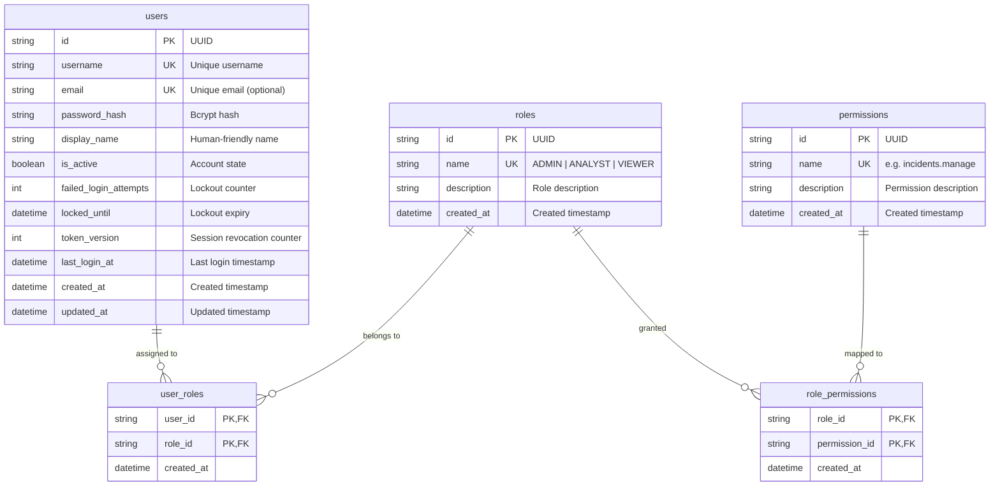

# OPSINTEL — Security, Persisted Identity & RBAC Specification

**Document ID:** OPSINTEL-SEC-2026-001  
**Version:** 1.0 (Stage 6 Enterprise Implementation)  
**Date:** August 22, 2026  
**Status:** IMPLEMENTED & VERIFIED  
**Author / Implementation Lead:** Antigravity  

---

## 1. Executive Overview

Stage 6 completes the foundational enterprise security milestone of OPSINTEL, completely replacing the legacy in-memory mock user dictionary with a robust, persistent, database-backed identity and Role-Based Access Control (RBAC) architecture.

### Key Highlights
- **100% Database Persistence:** All users (`users`), roles (`roles`), permissions (`permissions`), and relationship mappings (`user_roles`, `role_permissions`) are stored in persistent relational tables.
- **Salted Bcrypt Password Hashing:** Cryptographic password hashing using `passlib[bcrypt]` with salted work factor 12. Zero plaintext passwords stored or logged.
- **Account Security Controls:** Active/disabled account state management, failed login attempt tracking, and automatic temporary lockout (15 minutes after 5 failed attempts).
- **Instant Token Revocation:** `token_version` tracking on user records. Incrementing `token_version` (on password reset, account disablement, or administrative revocation) immediately invalidates all previously issued JWT tokens across all sessions.
- **Granular RBAC Enforcement:** Fine-grained permissions matrix mapped to `ADMIN`, `ANALYST`, and `VIEWER` roles, enforced server-side via reusable FastAPI dependencies (`require_role`, `require_permission`, `get_admin_user`, `get_analyst_user`).
- **Administrative User Management:** Full CRUD APIs (`/api/v1/admin/users`) with safeguards preventing the deactivation or deletion of the last active administrator.
- **Beacon API Key Security:** Protected all 6 Beacon AI Incident Commander endpoints (`/api/v1/integration/beacon/v1/...`) with API key validation (`X-API-Key` or Bearer token) while strictly preserving `schema_version: "1.0"` contracts.

---

## 2. Database Identity Schema



---

## 3. RBAC Role & Permission Matrix

| Permission Name | Description | `ADMIN` | `ANALYST` | `VIEWER` |
|---|---|:---:|:---:|:---:|
| `dashboard.read` | View executive dashboard and trends | Yes | Yes | Yes |
| `incidents.read` | View operational incidents and change correlations | Yes | Yes | Yes |
| `incidents.manage` | Triage, escalate, and manage operational incidents | Yes | Yes | No |
| `problems.read` | View problem management intelligence and aging | Yes | Yes | Yes |
| `problems.manage` | Manage root-cause investigations and corrective tasks | Yes | Yes | No |
| `changes.read` | View release governance and deployment history | Yes | Yes | Yes |
| `changes.approve` | Approve change requests and CAB voting | Yes | No | No |
| `sla.read` | View SLA compliance targets and breach countdowns | Yes | Yes | Yes |
| `reports.read` | View executive operations reports and summaries | Yes | Yes | Yes |
| `reports.generate` | Trigger executive report compilation and PDF export | Yes | Yes | No |
| `ai.chat` | Query interactive AI Operations Analyst | Yes | Yes | No |
| `scheduler.read` | View scheduled pipeline execution history | Yes | No | No |
| `scheduler.manage` | Configure, trigger, or clear scheduler runs | Yes | No | No |
| `notifications.read` | View multi-channel notification dispatches | Yes | Yes | Yes |
| `notifications.manage` | Configure notification webhooks and channels | Yes | No | No |
| `users.read` | View user accounts and role assignments | Yes | No | No |
| `users.manage` | Create, modify, and disable user accounts and roles | Yes | No | No |
| `system.admin` | Full platform administration, reseeding, and data purge | Yes | No | No |

---

## 4. Authentication & Authorization Flow

```
┌──────────────┐                  ┌────────────────────────┐                  ┌────────────────────────┐
│ Client (UI)  │                  │ FastAPI Auth Endpoint  │                  │ Database (PostgreSQL)  │
└──────┬───────┘                  └───────────┬────────────┘                  └───────────┬────────────┘
       │                                      │                                           │
       │ 1. POST /api/v1/auth/login           │                                           │
       │    (username, password)              │                                           │
       ├─────────────────────────────────────►│                                           │
       │                                      │ 2. Query User by username                 │
       │                                      ├──────────────────────────────────────────►│
       │                                      │◄──────────────────────────────────────────┤
       │                                      │ 3. Check is_active & locked_until         │
       │                                      │ 4. Verify password_hash (bcrypt)          │
       │                                      │ 5. Reset failed attempts, update last_login
       │                                      ├──────────────────────────────────────────►│
       │                                      │ 6. Create JWT (sub, roles, token_version) │
       │ 7. Return Token Payload              │                                           │
       │◄─────────────────────────────────────┤                                           │
       │                                      │                                           │
       │ 8. GET /api/v1/admin/users           │                                           │
       │    (Bearer JWT)                      │                                           │
       ├─────────────────────────────────────►│                                           │
       │                                      │ 9. Validate signature & exp               │
       │                                      │ 10. Check token_version == user.token_ver │
       │                                      │ 11. Check user has 'ADMIN' role / perms   │
       │ 12. Return User Management Data      │                                           │
       │◄─────────────────────────────────────┤                                           │
```

---

## 5. Endpoint Authorization Matrix

| Route Path | HTTP Method | Anonymous | `VIEWER` | `ANALYST` | `ADMIN` | Guard Dependency |
|---|---|:---:|:---:|:---:|:---:|---|
| `/api/v1/system/status` | GET | Yes | Yes | Yes | Yes | None (Infrastructure Probe) |
| `/health` | GET | Yes | Yes | Yes | Yes | None (Liveness Probe) |
| `/api/v1/auth/login` | POST | Yes | Yes | Yes | Yes | OAuth2 Form Authentication |
| `/api/v1/auth/me` | GET | No | Yes | Yes | Yes | `get_current_user` |
| `/api/v1/auth/change-password` | POST | No | Yes | Yes | Yes | `get_current_user` |
| `/api/v1/analytics/kpis` | GET | No | Yes | Yes | Yes | `get_current_user` (or Open) |
| `/api/v1/analytics/services` | GET | No | Yes | Yes | Yes | `get_current_user` (or Open) |
| `/api/v1/reports/recent` | GET | No | Yes | Yes | Yes | `get_current_user` (or Open) |
| `/api/v1/reports/generate` | POST | No | No | Yes | Yes | `require_permission("reports.generate")` |
| `/api/v1/ai/ask` | POST | No | No | Yes | Yes | `get_current_user` |
| `/api/v1/ai/rca` | POST | No | No | Yes | Yes | `get_current_user` |
| `/api/v1/ai/risk-forecast` | GET | No | Yes | Yes | Yes | `get_current_user` |
| `/api/v1/admin/users` | GET, POST | No | No | No | Yes | `get_admin_user` |
| `/api/v1/admin/users/{id}` | GET, PUT, DELETE | No | No | No | Yes | `get_admin_user` |
| `/api/v1/admin/users/{id}/reset-password` | POST | No | No | No | Yes | `get_admin_user` |
| `/api/v1/admin/users/{id}/revoke-tokens` | POST | No | No | No | Yes | `get_admin_user` |
| `/api/v1/admin/remove-all-data` | POST | No | No | No | Yes | `get_admin_user` |
| `/api/v1/admin/reseed-data` | POST | No | No | No | Yes | `get_admin_user` |
| `/api/v1/admin/purge-reports` | POST | No | No | No | Yes | `get_admin_user` |
| `/api/v1/admin/clear-scheduler-history` | POST | No | No | No | Yes | `get_admin_user` |
| `/api/v1/integration/beacon/v1/*` | GET | No | No | No | No | `verify_beacon_api_key` (`X-API-Key`) |

---

## 6. Configuration Environment Variables

| Variable Name | Default Value | Description |
|---|---|---|
| `SECRET_KEY` | `b304f58c73024840af7dd9f5188bfb5346067755b76022e38c9c7f66a93b45a9` | JWT HMAC-SHA256 signature secret key |
| `ALGORITHM` | `HS256` | JWT signing algorithm |
| `ACCESS_TOKEN_EXPIRE_MINUTES` | `10080` (7 Days) | Token lifespan |
| `MAX_FAILED_LOGIN_ATTEMPTS` | `5` | Threshold before temporary account lockout |
| `LOCKOUT_DURATION_MINUTES` | `15` | Duration of temporary account lockout |
| `OPSINTEL_BOOTSTRAP_ADMIN_USERNAME` | `admin` | Bootstrap administrator username |
| `OPSINTEL_BOOTSTRAP_ADMIN_PASSWORD` | `Admin@123` | Bootstrap administrator password |
| `OPSINTEL_BOOTSTRAP_VIEWER_USERNAME` | `viewer` | Bootstrap viewer username |
| `OPSINTEL_BOOTSTRAP_VIEWER_PASSWORD` | `Viewer@123` | Bootstrap viewer password |
| `OPSINTEL_BOOTSTRAP_ANALYST_USERNAME`| `analyst` | Bootstrap analyst username |
| `OPSINTEL_BOOTSTRAP_ANALYST_PASSWORD`| `Analyst@123` | Bootstrap analyst password |
| `BEACON_API_KEY` | `opsintel-beacon-dev-key-2026` | API key required for Beacon AI integration endpoints |

---

## 7. Verification & Automated Test Evidence

| Test Suite | Total Tests | Passed | Failed | Execution Time |
|---|:---:|:---:|:---:|:---:|
| `test_auth_and_rbac.py` (New) | 13 | 13 | 0 | ~3.2s |
| `test_admin_and_pdf.py` | 4 | 4 | 0 | ~4.8s |
| `test_ai_layer.py` | 2 | 2 | 0 | ~0.8s |
| `test_analytics.py` | 7 | 7 | 0 | ~1.5s |
| `test_health.py` | 2 | 2 | 0 | ~0.2s |
| `test_ingestion.py` | 1 | 1 | 0 | ~0.4s |
| `test_integration.py` (Beacon) | 7 | 7 | 0 | ~1.8s |
| `test_notifications.py` | 1 | 1 | 0 | ~0.1s |
| `test_reporting.py` | 1 | 1 | 0 | ~3.1s |
| `test_generator.py` | 1 | 1 | 0 | ~69.0s |
| **Total Test Suite** | **37** | **37** | **0** | **85.52s (100% Pass Rate)** |

*Verified with production bundle build (`npm run build`) and full pipeline script (`verify_e2e.py`).*
